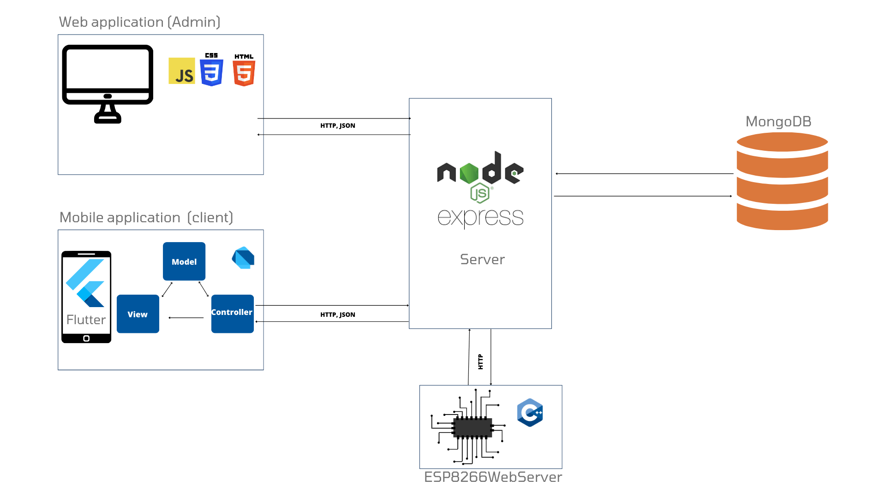
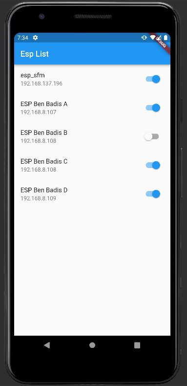
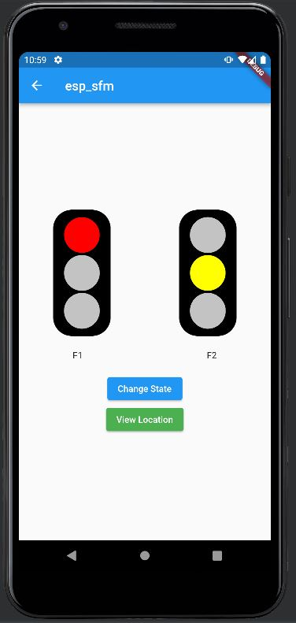
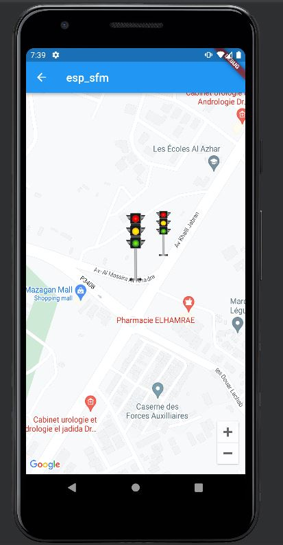

# Traffic Light Management Mobile App

This repository contains the **Flutter** mobile application for managing and visualizing traffic lights across a city. The app allows users to monitor the state of each traffic light, toggle power on/off, change light states, and view each traffic light's location on a map.

## Architecture Overview

The mobile app is part of a larger traffic light control system. Here’s a high-level architecture diagram of the entire system:

- **Node (Express.js) Server**: Acts as the central hub, managing traffic light data and synchronizing with ESP8266 devices.
- **MongoDB**: Stores data on traffic lights, their locations, and states.
- **ESP8266 Web Server**: Handles individual traffic lights, reporting their status and accepting commands from the server.
- **Web and Mobile Applications**: Provide interfaces for administrators and users to monitor and control the traffic lights.

## App Features

This mobile application enables users to:
- **View a list of all traffic lights**: Users can see the status of each light and toggle them on or off.
- **Monitor and change the state** of each traffic light: The app shows the current light color (red, yellow, green) and allows users to change it.
- **View traffic light locations on a map**: Users can view the geographical location of each traffic light.

## Screens

### Traffic Light List
The Traffic Light List screen displays all available traffic lights. Each item includes a toggle button to power the light on or off.

### Traffic Light Detail
The Traffic Light Detail screen shows the current state of the selected traffic light. Users can change the light’s color (red, yellow, green) using this screen.

### Traffic Light Location Map
The Traffic Light Location Map screen displays the location of the selected traffic light on a map, allowing users to view its geographical position.

## Getting Started

1. **Install Dependencies**: Make sure to install Flutter and set up your development environment.
2. **Run the App**: Use `flutter run` to start the app on a connected device or simulator.
3. **Connect to the Backend**: Ensure that the Node.js backend server is running and the ESP8266 devices are connected for full functionality.
